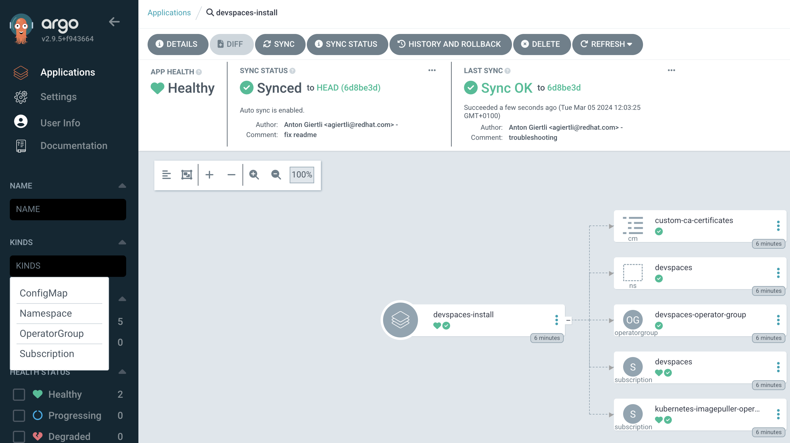
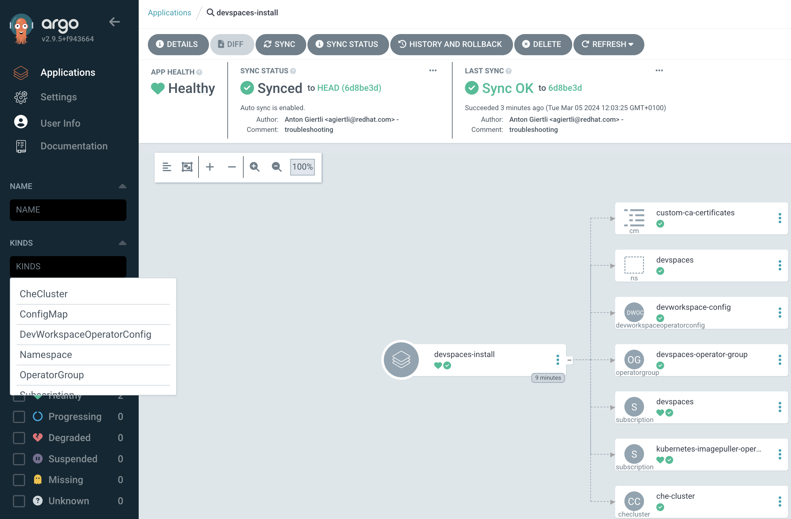

# GitOpsified showcase of selected Red Hat Products

This repository helps to get quickly up and running with selected Red Hat products. It's not meant to be used in production-like environments, but mostly for demo purposes.

Here is a list of currently supported ArgoCD Application and the respective Red Hat products which they install:

 - Red Hat OpenShift Dev Spaces
 - Red Hat Trusted Artifact Signer (RHTAS)
 - Namespace Config Operator (Community support only)
 - Red Hat Single Sign On (integrated with RHTAS)
 - ArgoCD RBAC - this is to prevent fixing ArgoCD with `cluster-admin` permissions and allow more fine grained permissions.

Component diagram of this solution looks like this:


## Usage

 - Configure what ArgoCD Application you want to enable in [parent application](argo-apps/tooling-app-of-apps/values.yaml)
 - If you want to use RHTAS, make sure to fix [argo-apps/rhtas-install/values.yaml](argo-apps/rhtas-install/values.yaml) so it fits your cluster
 - Using `oc` cli , log into the OpenShift cluster as cluster-admin
 - Execute installation script
 ```bash
cd install/
./install.sh -p <ARGO_CD_ADMIN_PASSWORD>
```
 - Once the command finishes, you can log in to the ArgoCD Console to observe the installation progress. You can locate the ArgoCD Server URL via:
  ```bash
  oc get route openshift-gitops-server -n openshift-gitops -o jsonpath='{.spec.host}{"\n"}'
  ```
 - Use `admin` username and password which you passed to the install script

## Troubleshooting

Despite ArgoCD being awesome, it's still a software written by human beings, thus riddled with bugs. This section describes the typical troubleshooting scenarios I have encountered while working on this solution.

### Parent App Error State

If the parent app ends up in error state as shown below:


You need to click `Refresh`. This will fix the error state and the parent application will be properly reconciled.


### Customer Resources not visible in the ArgoCD UI

If the operator custom resources are not visible in the ArgoCD UI despite them being added in the [Resource Inclusion](argo-apps/rbac/argocd-policy-patch.yaml) you need to delete few gitops pods

Before deleting pod:



Delete the pods by executing following command:

```bash
oc get pods -n openshift-gitops | grep gitops-server
oc delete pod <GITOPS_SERVER_POD_NAME> -n openshift-gitops
oc get pods -n openshift-gitops | grep redis
oc delete pod <REDIS_POD_NAME> -n openshift-gitops
```

Afte deleting pod:



